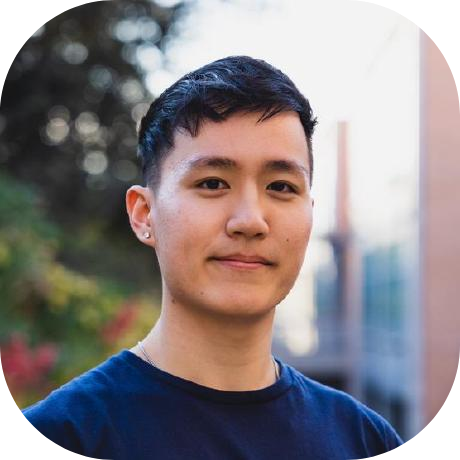
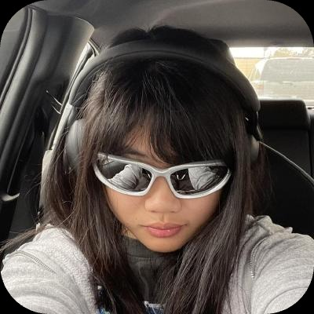
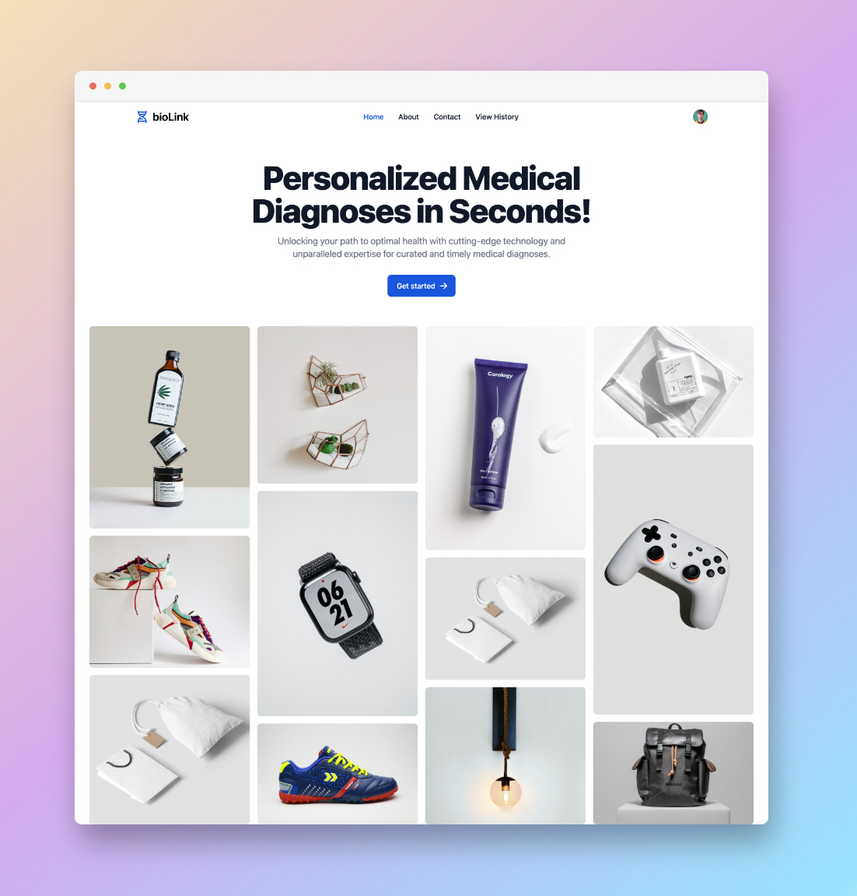
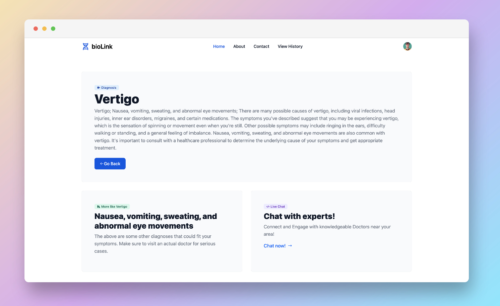
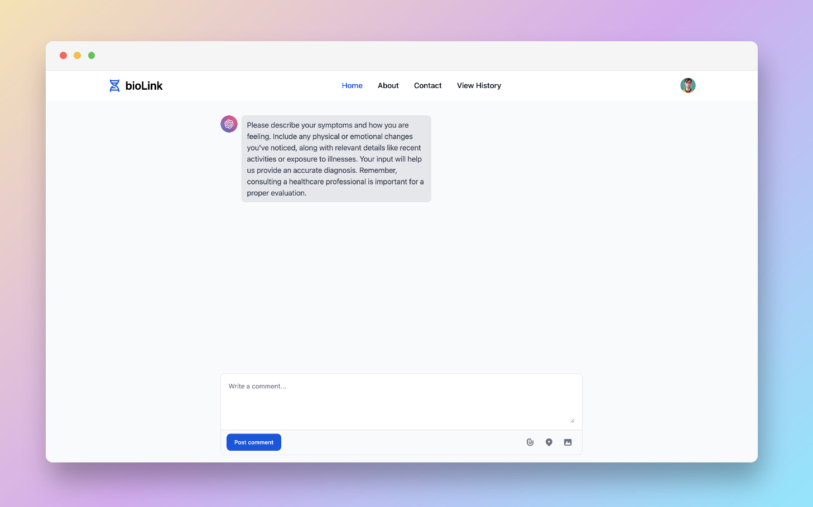
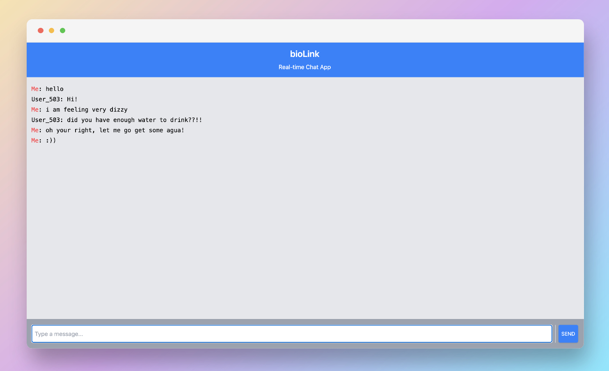

# bioLink | 🥇 1st Place Overall @ BioHack!

### Personalized Medical Diagnoses in Seconds!

#### Unlocking your path to optimal health with cutting-edge technology and unparalleled expertise for curated and timely medical diagnoses.

## Engineers

### Minsoo Kim

Hey I'm Minsoo! I'm a software engineer based in California. I like to weightlift or climb after a long day of coding :) You can connect with me on [LinkedIn](https://www.linkedin.com/in/minsookime/) • [Website](https://minsoo.vercel.app/) • [E-mail](mailto:minsooerickim@gmail.com).

 

### Mika Shanela

Hello I'm MikMik! I'm a software engineer based in SoCal. I love nature!!! :) I also lovvvvvveee climbing with all my heart! You can connect with me on [LinkedIn](https://www.linkedin.com/in/mika-shanela/)

 
 

## Tech Stack

## Final Mockups

#### Landing

#### Diagnosis

#### Chat

#### Live Chat

